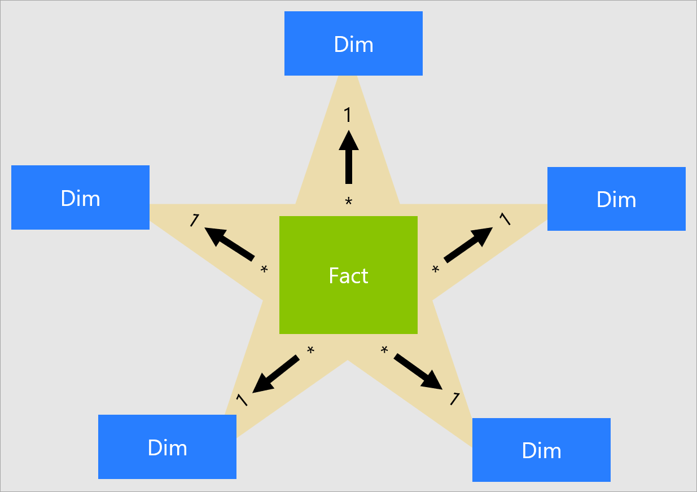
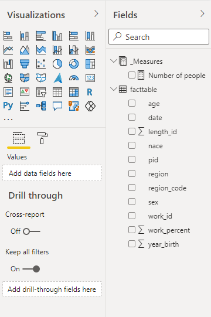
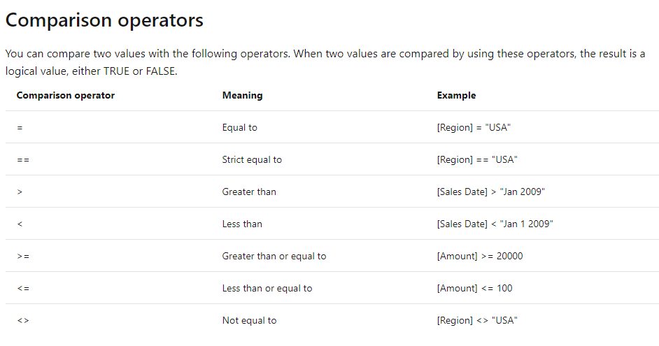

class: middle right
background-image: url(pictures/PowerBI_logo.png)
background-position: left

```{r setup, include=FALSE}
options(htmltools.dir.version = FALSE)
knitr::opts_chunk$set(
  fig.width=9, fig.height=3.5, fig.retina=3,
  out.width = "100%",
  cache = FALSE,
  echo = TRUE,
  message = FALSE, 
  warning = FALSE,
  fig.show = TRUE,
  hiline = TRUE
)
```

```{r metathis, echo=FALSE}
library(metathis)
meta() %>%
  meta_name("github-repo" = "https://github.com/skars82/slides") %>% 
  meta_social(
    title = "Introduction to business intelligence in public statistics (Power BI)",
    description = paste(
      "3-day course in how a business intelligence tool lik Power BI can be used in public statistics. ",
      "Course held by European Statitical Training Programme (ESTP) in april of 2021."
    ),
    url = "https://skars82.github.io/slides/estp_course_powerbi/day1.html#1",
    image = "https://github.com/skars82/slides/tree/master/docs/estp_course_powerbi/pictures/twitter_slide.png",
    image_alt = paste(
      "Title slide of day 1 of ESTP-course in Power BI:", 
      "How can Power BI be utilized in public statistics.", 
      "Estp-course held in april of 2021."
    ),
    og_type = "website",
    og_author = "Øyvind Bruer-Skarsbø",
    twitter_card_type = "summary_large_image",
    twitter_creator = "@YSkarsb",
    twitter_site = "@YSkarsb"
  )
```

```{r, echo=FALSE}
dark_yellow <- "#EFBE43"
light_yellow <- "#FDF7E9"
gray <- "#333333"
blue <- "#4466B0"
```


```{r xaringan-themer, include=FALSE, warning=FALSE}
library(xaringanthemer)
style_duo(
  # colors
  primary_color = light_yellow,
  secondary_color = dark_yellow,
  header_color = gray,
  text_color = gray,
  code_inline_color = colorspace::lighten(gray),
  text_bold_color = colorspace::lighten(gray),
  link_color = "#D6950F",
  title_slide_text_color = blue,
          # fonts
          header_font_google = google_font("Martel"),
          text_font_google = google_font("Lato"),
          code_font_google = google_font("Fira Mono"))
```

```{r xaringan-tile-view, echo=FALSE}
xaringanExtra::use_tile_view()
```

```{r share-again, echo=FALSE}
xaringanExtra::use_share_again()
```

```{r xaringan-logo, echo=FALSE}
xaringanExtra::use_logo(
  image_url = "pictures/ssb-logo-rgb300pxl.png", position=xaringanExtra::css_position(top="1em", right="1em")
)
```

```{r xaringan-animate-all, echo=FALSE}
xaringanExtra::use_animate_css()
```

```{r xaringan-scribble, echo=FALSE}
xaringanExtra::use_scribble()
```

.title[Introduction to business intelligence in public statistics (Power BI)]

.title[.posi2[Webinar hosted by European Statistical Training System (ESTP) and Statistics Norway (SSB)]]
<br>
.title[.posi[20.-22. april 2021]] 

???

- Welcome
<br>
<br>
- First ESTP-course
<br>
<br>
- a large group
<br>
<br>
- challenges with a webinar
<br>
<br>
- why the interest

---

## About us

.pull-left[


```{r, echo=FALSE, out.width="30%", fig.cap="Øyvind Bruer-Skarsbø"}
knitr::include_graphics("pictures/obr2.png")
```


```{r, echo=FALSE, out.width="30%", fig.cap="Carl Franklin Corneil"}

```


]

.pull-center[
.bio[
*Senior Advisor*  
*Division of Social Statistics*  
*Labour Market and Wage Statistics*  
*Statistics Norway*]
<br>
<br>
<br>
<br>
<br>
<br>
<br>
<br>
<br>

.bio2[
*Advisor*  
*Division of Social Statistics*  
*Labour Market and Wage Statistics*  
*Statistics Norway*]
]
---
class: inverse center middle right

## Aim of this course


.quote[
The aim of this course is to give the participants an understanding of how a business intelligence tool like Power BI can be usefull in the production of official statistics, and show how to build basic dashboards using Power BI Desktop.]


---

## About this course


- All resources available at the [course website](https://skars82.github.io/estp_course_pbi/)
<br>
<br>

--
- We assume that you have installed .animated.bounce.dib[[Power BI Desktop!](https://powerbi.microsoft.com/en-us/downloads/)]
<br>
<br>

--
- We are a big group (35 participants)
<br>
<br>

--
- Lets divide into 7 groups with 5 each for discussions


---
## What is Business intelligence (BI)? 

- Tools to ~~easily~~ extract and communicate insights from data
<br>
<br>

--
- Response to the growing amount of data in all organizations
<br>
<br>

--
- Make an organisation less dependent on its IT-departement
<br>
<br>

--
- An answer to the "webbrowser-takeover"
<br>
<br>

--
- A javascript-free life &#x1F60E;  


<div style="clear: right">
   ...text...
</div> 


---
class: top left
background-image: url(pictures/gartner_2020.png)
background-size: 80% 80%
background-position: bottom center

## Why Power BI?


---
class: inverse center middle

<div class="container">
<blockquote class="brooks">
I web, therefore I am <strike>spiderman</strike>
<br>
<footer>Yihui Xie, RStudio</footer>
</blockquote>
</div>

---

## Fundamentals of Power BI

- Microsoft product
<br>
<br>

--
- Very well integrated with the rest of Microsoft 365
<br>
<br>

--
- "*cradle to grave*" solution (from source-data to embeddable link)
<br>
<br>

--
- Tool for (mostly) descriptive statistics
<br>
<br>

--
- You .yellow1[can] use it without code
<br>
<br>

--
- Desktop-version is free, and the rest costs
<br>
<br>

--
- Can handle most data sources...even big data!
<br>
<br>

--
- can do webscraping, text-analyzes, machine-learning

---
class: inverse left 
background-image: url(pictures/pipeline.png)
background-position: center middle

## Basic PBI pipeline


---
class: inverse center middle

.animated.heartBeat.dib2[Breaktime!!]

---

## Group discussions

--

.pull-left[

### How?

- 5 in each group
<br>
<br>
- 15 minutes
<br>
<br>
- select 1 group leader
<br>
<br>
]

--
.pull-right[
### What?

- How are you gonna use PBI ? 
<br>
<br>
- Power BI service implemented? 
<br>
<br>
- Why did your boss send you here? 
<br>
<br>
]


---
## Main parts of Power BI

--

.pull-left[

### <span style="color: #EFBE43;">1. Report window</span>

- Visualizing
<br>
<br>
- Data model
<br>
<br>
- Publishing
]

--

.pull-right[

### <span style="color: #EFBE43;">2. Power Query</span>

- Extract/import data
<br>
<br>
- Transform data
<br>
<br>
- Load data

]

--
<br>
<br>
<br>
.animated.heartBeat.dib2.yellow[Lets open Power BI!]


---

## Task 1: Importing (more) data


- **Import** and **append** the the rest of the csv-files. Remember to do the same transformations as we did with with the first dataset!  

*Hint: There are many ways to do this, but remember the trick of duplicating queries in Power Query.
<br>
<br>
- After youre done importing data, check that data types and other things have not changed. 
<br>
<br>
- Load the data into the report-window. 
<br>
<br>
- Create a line chart with date on the x-axis and the number of people on the y-axis. 


---

## Building a data model

--
.pull-left[

### Star schema

- fundamental part the PBI-workflow
<br>
<br>
- 1 table that has all the variables to be aggregated
<br>
<br>
- all other information separated out to other tables
<br>
<br>
- requires some experience to set up if the data is large and you want to track changes within units over time (slowly changing dimensions)
<br>
<br>
- Dont worry!&#x1f60c; Only simple examples in this course..

]
 
--
.pull.right[
```{r, echo=FALSE, out.width="50%"}

```

]

--
.animated.pulse.dib.yellow[Lets open Power BI!]


???

- Create date table
<br>
<br>
- Create region_dim


---
## Task 2: Adding datasets to the model

- Import the file *sn07.dim.csv* (Standard Industrial Classification 2007)
<br>
<br>
- Clean the data so that we can connect it to to our main table
<br>
<br>
- Load data from Power Query to report page
<br>
<br>
- Connect it to the main dataset
<br>
<br>
- Create a matrix-visual that allows the user easily drill up and down from 1-digit to 5-digit NACE2007. The drilling should happen by the NACE-name and not the NACE-code! 

### Extra-task:

- Manually create a dimension-table for gender and connect it to the main dataset. Create a slicer that lets the user select which sex is diplayed in the matrix. 


---
## DAX

--
- DAX is the "programming language" of the report window. [See documentation](https://docs.microsoft.com/en-us/dax/dax-overview) 
<br>
<br>

--
- DAX is used to create measures, calculated columns and calculated tables. 
<br>
<br>

--

<style>
div.blue { color: #FDF7E9; font-size: 1.0em; background-color:#EFBE43; border-radius: 5px; padding: 20px;}
</style>
<div class = "blue">
Measures are dynamic calculation formulas where the results change depending on context.
</div>


--

- Measures a by far the most important and the focus in this course. 
<br>
<br>

--
- Organize your Measures in a separate table

.pull-right[
```{r, echo=FALSE, out.width="40%"}

```
]

---

## Basic DAX


.pull-left[

### Syntax


$MeasureName=$                   
  
$Function('TableName'[Column])$  


.yellow2[for example]


$People=COUNT('factable'[pid])$ 

.yellow2[counts the number of rows in the column **pid** in the table **factable**.]  
]

--

.pull-right[

### Important functions

- SUM
- COUNT
- DISTINCTCOUNT
- CALCULATE
- FILTER
- SELECTEDVALUE
]


---

## DAX Operators





---
class: inverse center middle

.animated.heartBeat.dib2[Lets write  
some DAX!!]


---

## Task 3: Write more DAX

- Create a visual that in some way shows the number of workers in each region.
<br>
<br>

--
- Insert a slicer that lets the "user" filter by year.  
<br>
<br>

--
- Create a measures that shows the count of working people last year relative to the chosen year. Copy-paste the visual from [1] and replace the measure with the new measure. 


---

## Project for day 2


- Pick a data source that is relevant to you and your work (API, database, csv, web, etc.)
<br>
<br>
- Think about what you want to display 
<br>
<br>
- Build a data model with the data
<br>
<br>
- Use dax to calculate measures
<br>
<br>
- Use company colors and logos to beatify your report
<br>
<br>
- Do a project that lets finish in a day (dont be over-ambitious...)
<br>
<br>
- Send us pdf-copy at the end of the day
<br>
<br>
- On day 3 you show it to the group and discuss
<br><br>

.yellow.dib[GOOD LUCK &#128513;]


---

## Discussing the tasks

- How was to work with Power BI? 
<br>
<br>
- What was the most difficult? 
<br>
<br>
- Did you model your data? 


  


